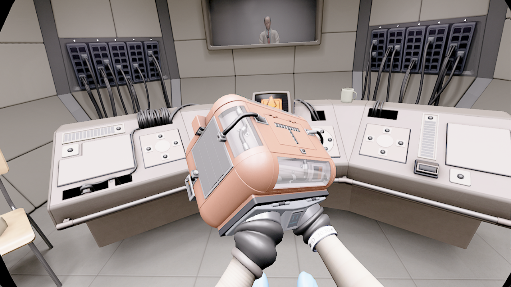

# StatikQuest

**Statik: Institute of Retention (PS4 / PlayStation VR) in virtual reality**, played from your own copy of the game through a PS4 emulator. Ways to play:

- **On a Windows PC, shown in the Quest through Virtual Desktop**: the PC runs the emulator, and Virtual Desktop connects the headset through its VDXR OpenXR runtime.
- **On a Windows PC with a SteamVR headset**: the same PC build uses SteamVR's OpenXR runtime and a controller connected to the PC. Other PC headsets use an OpenXR runtime of their own; not all headset/controller combinations have been tested with Statik.

There is no standalone Quest build: **a Windows PC is required**.

The emulator is [shadPS4](https://github.com/shadps4-emu/shadPS4), with inherited work from [AstroQuest](https://github.com/bigmak94/AstroQuest) and [shadps4-arm64](https://github.com/zenithblue-oss/shadps4-arm64). This fork adapts that work for Statik, with fixes for stereo rendering, tracking, reprojection and other issues under emulation.

The code additions for Statik support were made 100% by AI: GPT-6.1 Sol in Codex. This credit applies to the Statik-specific additions, not the inherited AstroQuest, shadPS4 or third-party code.

> **No game files are included or distributed.** You need your own copy of Statik: Institute of Retention, dumped from your own PlayStation 4.



## Status

Work in progress. Most levels have been tested, but not all. The current Windows build has passed regression checks and a headset play test; full-game completion and compatibility with every headset, controller and PC have not been verified. Expect rough edges, and please report what you find.

## What you need

- **A VR headset connected to a Windows PC**, through Virtual Desktop or a PC OpenXR runtime such as SteamVR. There is no app to install on the headset itself.
- **For positional controller tracking through Virtual Desktop**, enable hand tracking on the headset and Virtual Desktop's **Forward tracking data to PC** feature so the controller can be positioned using your tracked hands.
- **Something to play with.** A PS5 DualSense controller is the closest match to the PS4 controller the game expects, with buttons, sticks, touchpad and motion sensors. A DualShock 4 is another option. Alternative gamepads and VR-controller replacement have not been fully verified with Statik.
- **Statik: Institute of Retention, European base release CUSA06929**, dumped from your own console and game: either as the game's folder (the one with `eboot.bin`, `sce_sys` and `sce_module` in it), or as the `.pkg` package made from the dump, which the PC launcher unpacks by itself. A package downloaded from the PlayStation Store is encrypted and cannot be used; a package that is only the game's update is not the game. Other regions and updates are unverified.
- **A 64-bit Windows PC**, a Vulkan-capable graphics card and suitable driver, and the [Microsoft Visual C++ Redistributable (x64)](https://aka.ms/vs/17/release/vc_redist.x64.exe) (the launcher says so if it is missing). For Quest through Virtual Desktop, you need [Virtual Desktop](https://www.vrdesktop.net/) on the headset and its Streamer on the PC.

## Installing: PC VR through Virtual Desktop

Download the Windows PC ZIP from the [latest release](https://github.com/Jerware/StatikQuest/releases/latest) and unzip it. There is no standalone Quest APK.

A source checkout does not include the emulator executable: follow [Building from source](#building-from-source) first. With a prepared PC build, keep the whole folder together, then:

1. **Put it in a folder with a short path**, e.g. `C:\Games\StatikQuest`. Some of the game's files have long names, and the emulator cannot open a file whose full path exceeds Windows' path limit. The launcher warns if the game path is too long.
2. **Put your copy of the game in its `games` folder**, anywhere in it: the game's folder (the one with `eboot.bin` in it) or its `.pkg` file. A compatible package is unpacked the first time you start. You can also leave the game where it is: when the launcher finds none, a window asks where it is and remembers the answer. The original package is kept; existing installations are not overwritten.
3. **Set up Virtual Desktop**: install the Streamer on the PC and, in its Options, choose **VDXR** as the OpenXR runtime.
4. **Connect the DualSense to the PC**, by USB cable or by Bluetooth paired with the PC, not with the headset: paired with the headset, it can reach the PC without motion sensors or touchpad. Disable Steam Input if using a Steam shortcut.
5. **Connect to the PC with Virtual Desktop**, then start **`Play Statik VR.bat`** on the desktop you see in the headset. The first time, it offers to unpack the game if it is a package (or asks where the game is). Then a small window lets you choose the console language (Windows' own unless you choose another), field of view and desktop view; Play starts the game.

Leave the settings at their defaults for your first run and follow Statik's in-game prompts.

For a SteamVR headset, start SteamVR with SteamVR selected as the OpenXR runtime instead of setting up Virtual Desktop. The launcher uses the active runtime; it does not change your system's runtime setting.

All settings and what to do when something does not work are in [README-PC-VR.md](README-PC-VR.md).

## Common questions

**How do I get the game onto my computer?** This project gives no information on how to get games, and this repository does not include any game data.

**Which headsets?** A PC-connected headset with an OpenXR runtime on Windows. Quest headsets connect through a PC VR connection such as Virtual Desktop; SteamVR headsets use SteamVR. This is not a claim that every headset has been tested with Statik. There is no standalone Quest app.

**Do I need a PlayStation controller?** A DualSense or DualShock 4 is the intended starting point. Statik's puzzles use the gamepad's controls and motion; alternative controllers and VR-controller replacement are not fully verified.

**Without Virtual Desktop?** For a SteamVR headset, use SteamVR as the OpenXR runtime. Start SteamVR first, then `Play Statik VR.bat`; see [README-PC-VR.md](README-PC-VR.md).

**Where is the option to unpack the game?** When the launcher cannot find a game, choose **Show where it is...** and select its `.pkg`, or put the package in `games` and choose **Look again**. If an extracted game is already found, that setup window is skipped. The launcher supports compatible unencrypted base-game `.pkg` files, not `.iso` files or update-only packages.

**Where are my saves?** Under `pc-vr/user/home`. Keep that profile when updating. Personal settings, modules, saves, logs and caches are excluded from Git, but a used play folder still contains them: do not zip and share the whole working folder as a release.

**How do I report a problem?** Include your headset/controller, PC specifications, game version and what happened. Logs are in `pc-vr/user/log`; check them for private information before sharing. Do not include game files, modules or saves.

## Building from source

Clone with the submodules:

```sh
git clone --recurse-submodules https://github.com/Jerware/StatikQuest.git
```

The PC build uses Visual Studio C++ Build Tools with a Windows SDK and CMake/Ninja, plus LLVM (`clang-cl`, `llvm-lib` and `llvm-rc`). LLVM 21.1.8 was used locally. No Sony SDK is required.

- **PC build**: `tools/build_pcvr_release.ps1` builds the emulator, then `tools/make-pc-vr.ps1` puts it in `pc-vr/`.
- **Regression checks**: `tools/test_pcvr_release.ps1` runs the native and launcher tests.
- `tools/make-release.sh <version>` packs clean PC-only staging files into `build/release/`. It uses PkgTool 0.2.231 for package extraction.

The full commands and requirements are in [docs/BUILDING.md](docs/BUILDING.md). Packaging does not upload a release.

## License

StatikQuest is free software, licensed under the [GNU General Public License, version 2 or (at your option) any later version](LICENSE) (GPL-2.0-or-later), the license of shadPS4 it is built on.

The third-party components it uses or ships keep their own licenses, including PkgTool (LGPL-3.0), the Khronos OpenXR SDK (Apache-2.0) and the libraries under `shadps4-arm64-main/externals`. See [THIRD-PARTY-NOTICES.md](THIRD-PARTY-NOTICES.md) for their notices and sources.

This project is not affiliated with, endorsed or sponsored by the game's publisher, Sony, Meta or headset vendors. It contains no game, firmware, keys or other copyrighted console files: use it only with software you own and have dumped yourself.

## Thanks

- **[bigmak94/AstroQuest](https://github.com/bigmak94/AstroQuest)**, for the project and PSVR work this fork builds on.
- **The [shadPS4](https://github.com/shadps4-emu/shadPS4) team and contributors.** None of this would exist without their PlayStation 4 emulator: everything here is built on top of their years of work. Thank you!
- [zenithblue-oss/shadps4-arm64](https://github.com/zenithblue-oss/shadps4-arm64), for the inherited emulator source.
- [LibOrbisPkg](https://github.com/maxton/LibOrbisPkg), whose PkgTool unpacks game packages for the PC launcher.
- Everyone who reported what went wrong, and those who sent fixes along in AstroQuest and shadPS4, including the shared OpenXR and spectator-view work.
- [The Khronos Group](https://www.khronos.org/) for OpenXR and Vulkan, and [Virtual Desktop](https://www.vrdesktop.net/) for the PC streaming path.
